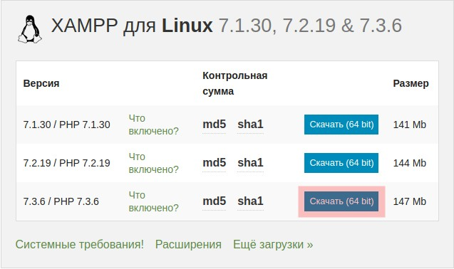
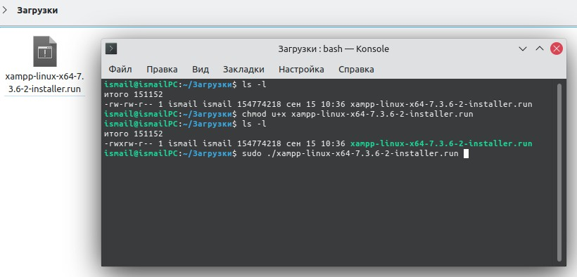
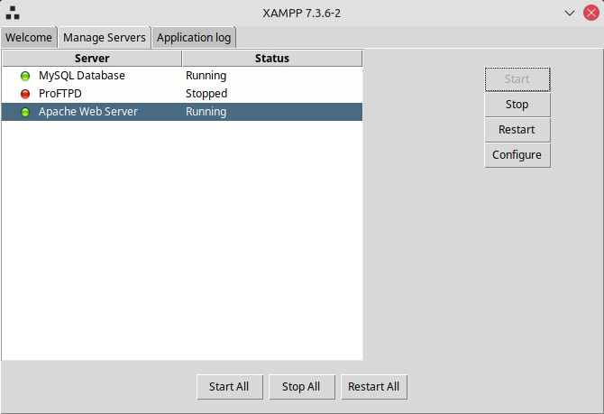
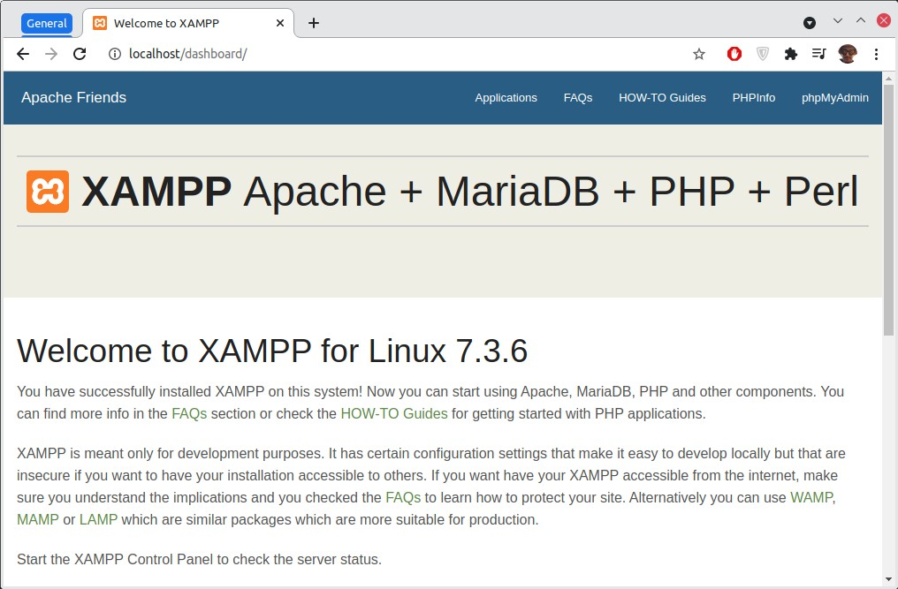
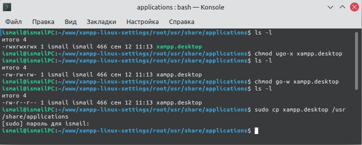
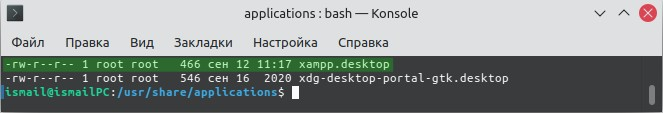
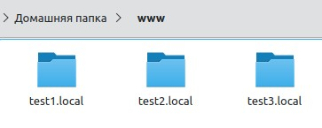
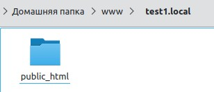

# Настройка локального web-сервера Xampp на Linux

XAMPP - кроссплатформенная сборка локального веб-сервера, содержащая Apache, MySQL, интерпретатор скриптов PHP, язык программирования Perl и большое количество дополнительных библиотек, позволяющих запустить полноценный веб-сервер.

## Установка и запуск

1. [Скачать Xampp](https://www.xampp.ru/download.html)  

  

2. Установить Xampp
- открыть терминал в каталоге с файлом xampp
> ctrl + alt + t
- сделать скаченный файл исполняемым и установить
> ls -l  
> chmod u+x file_name  
> sudo ./file_name  
 

- запустить Xampp
> sudo '/opt/lampp/manager-linux-x64.run'
 

- открыть в браузере адрес localhost/

3. Создать ярлык для Xampp и добавить его в меню запуска приложений
- создать текстовый файл с названием xampp.desktop

[Посмотреть файл xampp.desktop](root/usr/share/applications/xampp.desktop)

- установить права для файла -rw-r--r--
> chmod g-w file_name
- скопировать файл в каталог /usr/share/applications

- проверить права файла xampp.desktop в /usr/share/applications  
- владелец файла и группа должны быть root

- в меню приложений теперь есть Xampp
- можно удалить файл xampp.desktop там, где мы его создали

## Настройка сервера

1. Зайти в домашнюю директорию пользователя и создать каталог www
2. В этом каталоге создать любое количество каталогов - это будут наши отдельные домены на локальном сервере, например: test1.local, test2.local, test3.local

3. В каждом из этих каталогов создать каталог public_html

4. Перейти в каталог /opt/lampp/etc
5. Открыть файл httpd.conf в любом текстовом редакторе
6. Раскомментировать строку 488 (убрать символ #)

> Include etc/extra/httpd-vhosts.conf

7. На строках 173, 174 указать имя своего пользователя и группы

> User ismail  
> Group ismail

[Посмотреть файл httpd.conf](root/opt/lampp/etc/httpd.conf)

8. Перейти в каталог /opt/lampp/etc/extra
9. Открыть файл httpd-vhosts.conf в любом текстовом редакторе
10. Указать правильные пути до ранее созданных каталогов

[Посмотреть файл httpd-vhosts.conf](root/opt/lampp/etc/extra/httpd-vhosts.conf)

11.  Перейти в каталог /etc
12.  Открыть файл hosts в любом текстовом редакторе
13.  Добавить следующие строки для сопоставления адреса и названия сайта

> 127.0.0.1	test1.local  
> 127.0.0.1	test2.local  
> 127.0.0.1	test3.local

[Посмотреть файл hosts](root/etc/hosts)

14. Запустить Xampp и перезагрузить все сервера на вкладке Manage Servers
15. Поместить файлы сайта в /home/user_name/www/test1.local/public_html/ и открыть в браузере адрес
 
> test1.local/

По аналогии можно работать в других каталогах которые мы создали test2.local и test3.local если требуется больше, то создать по этому примеру другие каталоги и настроить файл httpd-vhosts.conf для работы с этими каталогами. 

Чтобы запустить phpMyAdmin и работать с базами данных нужно перейти по адресу

> localhost/phpmyadmin/

### Автору на кофе

### Контакты

